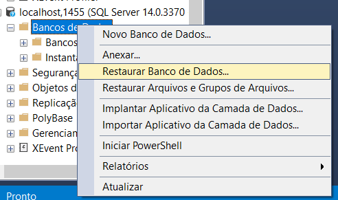
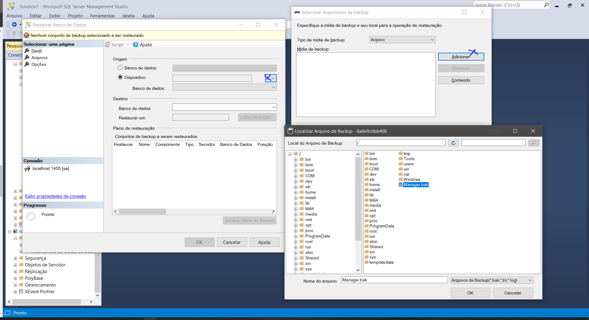

# register-users
Project to Inbev using aspnet.core 3.1 and angular 11

## Docker command to generator the server Database
###### 1 - Create Docker container

```sh
docker run -e "ACCEPT_EULA=Y" -e "SA_PASSWORD=Helloworld123" -e "MSSQL_PID=Express" -p 1433:1433  --name sql1 -d mcr.microsoft.com/mssql/server:2017-latest
```

 ###### 2 - Copy Database to Container
```sh
 docker cp ./database/Manager.bak sql1:/ 
```

###### 3 - Import from SQL SERVER MANAGEMENT STUDIO
Login in server data base

```
server: localhost
user: sa
password: Helloworld123
```

Follow it steps to import.






## Run API from Visual Studio 

1 - Restore NuGet package from Solution
2 - Set ManagerAPI as Startup Project
3- Execute ISS Express and the API will open Swagger Documentation API

## Install and Open Angular Project 

1 -  npm i
2 - to run `ng serve`
3 - to unit test `ng test`

## To login

1 - user: `fredmpeixoto@gmail.com` | password: `123456`

